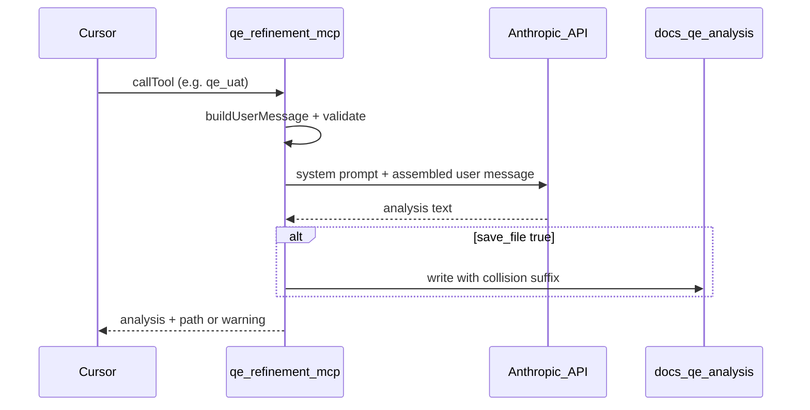

# QE Intelligence Suite

Structured Senior QE analysis in Cursor via MCP: backlog refinement, sprint UAT, ticketless repo UAT, bug triage, and regression — with a consistent **11-section**, risk-first output contract.

**Live showcase:** portfolio page at `/qe-intelligence-suite` (e.g. `https://<your-domain>/qe-intelligence-suite` when deployed).

| Layer | What it is |
|-------|------------|
| **This repo** | `qe-refinement-mcp` — stdio MCP server, sanitized system prompt (`PROMPT_VERSION`: `skill-v1-sanitized`), optional writes to `docs/qe-analysis/` |
| **Your machine** | Cursor + `~/.cursor/mcp.json` + personal Anthropic API key (BYOK) |
| **Not included** | Hosted MCP endpoint, shared API keys, or automatic repo crawling (the IDE agent should explore the repo, then call tools with enriched args) |

## Architecture



## Five MCP tools

| Tool | Mode | When to use |
|------|------|-------------|
| `qe_refinement` | REFINEMENT | Backlog / story refinement before dev |
| `qe_uat` | UAT | Release readiness with ticket or written AC |
| `qe_repo_uat` | REPO_UAT | Ticketless UAT — agent explores repo first, passes `feature` + `repo_hints` |
| `qe_bug` | BUG | Defect triage and missed-coverage analysis |
| `qe_regression` | REGRESSION | Blast radius and retest strategy |

## Quickstart

**Requirements:** Node 22+ (for `node --env-file` and built-in test runner).

```bash
cd qe-refinement-mcp
npm install
npm run build
test -f dist/server.js && echo "Build OK"
```

### 1. API key (BYOK)

```bash
cp qe-refinement-mcp/.env.example qe-refinement-mcp/.env
# Edit .env — paste your Anthropic key. Never commit .env.
```

Optional: `REPO_ROOT=/absolute/path/to/target-repo` so analyses save under that repo’s `docs/qe-analysis/` (defaults to process cwd).

### 2. Cursor MCP (`~/.cursor/mcp.json`)

Use **absolute paths** on your machine. Keep the key in `.env`, not in `mcp.json`.

```json
{
  "mcpServers": {
    "qe-refinement": {
      "command": "node",
      "args": [
        "--env-file",
        "/ABSOLUTE/PATH/qe-intelligence-suite/qe-refinement-mcp/.env",
        "/ABSOLUTE/PATH/qe-intelligence-suite/qe-refinement-mcp/dist/server.js"
      ]
    }
  }
}
```

Restart Cursor after saving. The server exits at startup with a clear error if `ANTHROPIC_API_KEY` is missing.

### 3. First test — chat only

Call any tool with **`save_file: false`** first (e.g. from Cursor’s MCP UI or agent). You should get the full analysis in chat plus a footer:

```text
---
Chat-only mode (save_file=false).
```

No file is written until you run again with `save_file: true` (default). On save, the response appends `Saved to: docs/qe-analysis/...` or a warning if the write failed.

**Local dev** (stdio, same `.env`):

```bash
cd qe-refinement-mcp && npm run dev
```

## Sample outputs

Committed examples (sanitized, fictional scope) under [`docs/qe-analysis/samples/`](docs/qe-analysis/samples/):

- [REFINEMENT — promo code at checkout](docs/qe-analysis/samples/qe-analysis-REFINEMENT-promo-code-checkout-2026-05-18.md)
- [UAT — checkout promo flow](docs/qe-analysis/samples/qe-analysis-UAT-checkout-promo-flow-2026-05-18.md)

## Prompt hygiene

Embedded prompt is derived from the Cursor `qe-analysis` skill with org-specific references removed. Before release, verify no **Matrix**, **dxp**, or **Squiz** strings:

```bash
grep -iE 'matrix|dxp|squiz' qe-refinement-mcp/src/core/prompt.ts && echo 'FAIL' || echo 'Prompt OK'
```

When the skill changes, update `qe-refinement-mcp/src/core/prompt.ts` and bump `PROMPT_VERSION` in `src/core/constants.ts`.

## Relation to portfolio demos

| Demo | Role |
|------|------|
| **QE Intelligence Suite** (this repo) | IDE MCP, BYOK, five structured tools, file artifacts |
| **QE assistant** (`/qe-assistant`) | Browser chat; server-side API key on Vercel |
| **QE showcase** (`/qe-showcase`) | Strategy narrative + links to other demos |
| **CI dashboard** (`/ci-dashboard`) | Pipeline observability sample / Supabase ingest |
