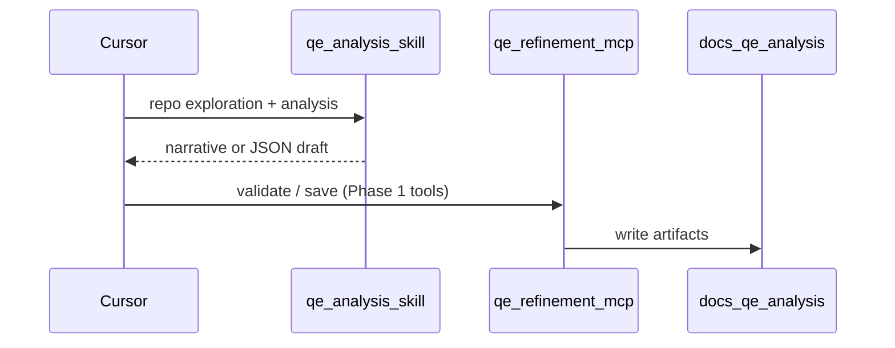

# QE Intelligence Suite

Structured Senior QE analysis in Cursor: backlog refinement, sprint UAT, ticketless repo UAT, bug triage, and regression — with a consistent **11-section**, risk-first output contract.

**Live showcase:** portfolio page at `/qe-intelligence-suite` (e.g. `https://<your-domain>/qe-intelligence-suite` when deployed).

| Layer | What it is |
|-------|------------|
| **This repo** | `qe-refinement-mcp` — stdio MCP server, sanitized system prompt (`PROMPT_VERSION`: `skill-v2-evidence-json`), optional writes to `docs/qe-analysis/` |
| **Analysis (recommended)** | Cursor **`qe-analysis` skill** — run analysis in your IDE thread with repo exploration |
| **MCP server** | Local validate, envelope, render, and save (deterministic `qe_*` tools ship in Phase 1) |
| **Not included** | Hosted MCP endpoint, shared API keys, server-side LLM calls, or automatic repo crawling (the IDE agent should explore the repo, then pass enriched args) |

**This server does not call any external LLM API.** Use the skill for generation; connect MCP for upcoming deterministic tooling.

## Architecture



Until Phase 1 lands, the MCP server starts with **no registered tools** and logs a stderr hint to use the skill. Deterministic tools planned: `qe_get_system_prompt`, `qe_validate_report`, `qe_save_report`, and related helpers.

## Quickstart

**Requirements:** Node 22+ (for `node --env-file` and built-in test runner).

```bash
cd qe-refinement-mcp
npm install
npm run build
test -f dist/server.js && echo "Build OK"
```

Optional: `REPO_ROOT=/absolute/path/to/target-repo` so analyses save under that repo’s `docs/qe-analysis/` (defaults to process cwd).

### Cursor MCP (`~/.cursor/mcp.json`)

Use **absolute paths** on your machine. No API keys or LLM env vars required.

```json
{
  "mcpServers": {
    "qe-refinement": {
      "command": "node",
      "args": [
        "/ABSOLUTE/PATH/qe-intelligence-suite/qe-refinement-mcp/dist/server.js"
      ]
    }
  }
}
```

Restart Cursor after saving.

**Local dev** (stdio):

```bash
cd qe-refinement-mcp && npm run dev
```

### First workflow — skill in Cursor

1. Install or enable the **`qe-analysis`** skill in Cursor.
2. Explore the repo in chat, then run analysis per the skill template.
3. Connect this MCP for deterministic validate/save tools when Phase 1 ships.

## Sample outputs

Committed examples (sanitized, fictional scope) under [`docs/qe-analysis/samples/`](docs/qe-analysis/samples/):

- [REFINEMENT — promo code at checkout](docs/qe-analysis/samples/qe-analysis-REFINEMENT-promo-code-checkout-2026-05-18.md)
- [UAT — checkout promo flow](docs/qe-analysis/samples/qe-analysis-UAT-checkout-promo-flow-2026-05-18.md)

## Prompt hygiene

Embedded prompt is derived from the Cursor `qe-analysis` skill with org-specific references removed. Before release, verify no **Matrix**, **dxp**, or **Squiz** strings:

```bash
grep -iE 'matrix|dxp|squiz' qe-refinement-mcp/src/core/prompt.ts && echo 'FAIL' || echo 'Prompt OK'
```

When the skill changes, update `qe-refinement-mcp/src/core/prompt.ts` and bump `PROMPT_VERSION` in `src/core/constants.ts`.

## Relation to portfolio demos

| Demo | Role |
|------|------|
| **QE Intelligence Suite** (this repo) | IDE skill for analysis; MCP for local validate/save (no cloud LLM in server) |
| **QE assistant** (`/qe-assistant`) | Browser chat; server-side API key on Vercel |
| **QE showcase** (`/qe-showcase`) | Strategy narrative + links to other demos |
| **CI dashboard** (`/ci-dashboard`) | Pipeline observability sample / Supabase ingest |
