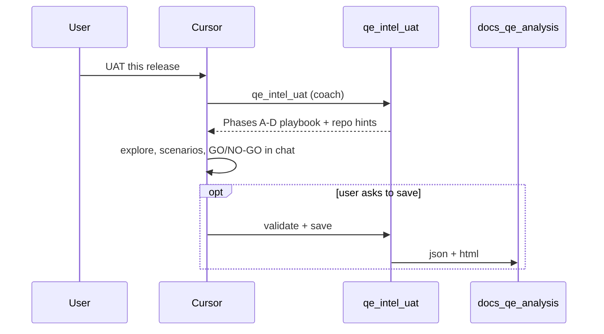

# QE Intelligence Suite

**Guided QE in Cursor** for teams with mixed QA depth: copilot coaching (phased playbooks) plus optional formal reports. Modes: refinement, UAT, repo charter, incident, regression.

## Trust-first default

| | Playwright MCP | **QE MCP (default)** |
|--|----------------|----------------------|
| LLM inside the server | No | **No** |
| API key in MCP config | No | **No** |
| What MCP does | Browser / DOM tools | **`qe_intel_*` guided runs** + optional validate/save |
| Who does the QE thinking | IDE agent | **IDE agent** (skills + phased playbook from MCP) |

**Install story:** `npx qe-intel-mcp init` (six skills) + MCP `qe-intel`. Agent calls **`qe_intel_refinement`** (etc.) first — coach output in chat by default; files only when asked.

**Data handling:** See **[`docs/data-handling.md`](docs/data-handling.md)** — what stays local vs what goes to your IDE provider.

| Layer | What it is |
|-------|------------|
| **This repo** | `qe-intel-mcp` — `qe_intel_*` guided runs (`PROMPT_VERSION`: `intel-v1-coach`), optional artifacts under `docs/qe-analysis/` |
| **Skills** | Router `qe-analysis` + five mode skills — trigger the right `qe_intel_*` tool |
| **MCP server** | Phased playbook in one call; repo scan hints under `REPO_ROOT`; Phase E validate/save — **no API key** |
| **Not included** | In-server LLM, API keys, hosted inference |

**This server does not call any external LLM API.**

## MCP tools

**Primary (start here):**

| Tool | Purpose |
|------|---------|
| `qe_intel_refinement` | Guided story grooming |
| `qe_intel_uat` | Guided release gate |
| `qe_intel_repo_uat` | Guided repo charter |
| `qe_intel_bug` | Guided incident analysis |
| `qe_intel_regression` | Guided retest scope |
| `qe_intel_review` | Draft quality check |

**Phase E (optional):** `qe_validate_report`, `qe_save_report`, `qe_save_markdown`, `qe_get_system_prompt`, `qe_get_json_schema`

No API key. Coach-tier success = better QE in chat, not a file on disk.

## Architecture



## Quickstart

**Requirements:** Node 22+ (for `node --env-file` and built-in test runner).

### Install via npx (published package)

After [`qe-intel-mcp` is on npm](https://www.npmjs.com/package/qe-intel-mcp), add to `~/.cursor/mcp.json`:

```json
{
  "mcpServers": {
    "qe-intel": {
      "command": "npx",
      "args": ["-y", "qe-intel-mcp@latest"],
      "env": {
        "REPO_ROOT": "/ABSOLUTE/PATH/to/your/target-repo"
      }
    }
  }
}
```

Restart Cursor. **No API keys.**

**Migrating from `qe-refinement`:** rename the MCP key to `qe-intel` and use `qe-intel-mcp@latest` in `args`. Tool names (`qe_validate_report`, etc.) are unchanged.

### Install the skill (`init`)

```bash
npx qe-intel-mcp init
# team repo: npx qe-intel-mcp init --project /absolute/path/to/repo
# preview:  npx qe-intel-mcp init --dry-run
```

Copies **six skills** into `~/.cursor/skills/` (or project `.cursor/skills/`). Restart Cursor again.

**Example prompts:** [`qe-intel-mcp/README.md`](qe-intel-mcp/README.md).

### Install from source (this repo)

```bash
cd qe-intel-mcp
npm install
npm run build
test -f dist/server.js && echo "Build OK"
```

Optional: `REPO_ROOT=/absolute/path/to/target-repo` so analyses save under that repo’s `docs/qe-analysis/` (defaults to process cwd).

### Cursor MCP — local clone (`~/.cursor/mcp.json`)

Use **absolute paths** on your machine. **No API keys.**

```json
{
  "mcpServers": {
    "qe-intel": {
      "command": "node",
      "args": [
        "/ABSOLUTE/PATH/qe-intelligence-suite/qe-intel-mcp/dist/cli.js"
      ],
      "env": {
        "REPO_ROOT": "/ABSOLUTE/PATH/to/your/target-repo"
      }
    }
  }
}
```

Restart Cursor after saving.

Publish checklist for maintainers: [`qe-intel-mcp/README.md`](qe-intel-mcp/README.md#publishing-maintainers).

**Local dev** (stdio):

```bash
cd qe-intel-mcp && npm run dev
```

### Guided run (default)

| Step | Owner | Action |
|------|--------|--------|
| 1 | Cursor | Match intent → skill → **`qe_intel_<mode>`** with ticket/context (`output_tier: coach`) |
| 2 | MCP | Return phased playbook (A–D), repo **where to look** hints under `REPO_ROOT`, input gaps if thin |
| 3 | Cursor | Execute phases in chat — questions, risks, scenario table, GO/NO-GO / AC gaps |
| 4 | Cursor (optional) | **`qe_intel_review`** on draft |
| 5 | MCP (optional) | Phase E: validate + save only if user wants files |

See `qe-intel-mcp/skills/shared/intel-run.md`. Full 11-section / JSON contract: `output_tier: full` + `artifact-run.md`.

### Output artifact table

| `output_format` | Files written (`save_file=true`) | MCP chat body |
|-----------------|----------------------------------|---------------|
| `markdown` (default) | `docs/qe-analysis/qe-analysis-{MODE}-{slug}-{date}.md` only | Full markdown or summary + `Saved to:` footer |
| `json` | Same stem: `.json` (envelope) + `.html` — **no** `.md` | Short summary (mode, confidence, risks, scenario counts) + paths — not full HTML |
| JSON parse/validate failure | Optional `.raw.txt` only if wired — not default | Error list + path to raw file when saved |

Collision suffix (`-2`, `-3`) applies to the **stem** before extension; sibling `.json` and `.html` share one stem.

Regenerate committed v2 samples after schema or renderer changes:

```bash
cd qe-intel-mcp && npm run build && node scripts/write-v2-samples.mjs
```

## Sample outputs (Phase E artifacts)

Committed examples (sanitized, fictional scope):

**v1 — Markdown** ([`docs/qe-analysis/samples/`](docs/qe-analysis/samples/)):

- [REFINEMENT — promo code at checkout](docs/qe-analysis/samples/qe-analysis-REFINEMENT-promo-code-checkout-2026-05-18.md)
- [UAT — checkout promo flow](docs/qe-analysis/samples/qe-analysis-UAT-checkout-promo-flow-2026-05-18.md)

**v2 — JSON envelope + tabbed HTML** ([`docs/qe-analysis/samples/v2/`](docs/qe-analysis/samples/v2/)) — hybrid validate/save path:

- [REFINEMENT — promo code at checkout (JSON)](docs/qe-analysis/samples/v2/qe-analysis-REFINEMENT-promo-code-at-checkout-2026-05-21.json) · [HTML](docs/qe-analysis/samples/v2/qe-analysis-REFINEMENT-promo-code-at-checkout-2026-05-21.html)
- [UAT — checkout promo flow (JSON)](docs/qe-analysis/samples/v2/qe-analysis-UAT-checkout-promo-flow-2026-05-21.json) · [HTML](docs/qe-analysis/samples/v2/qe-analysis-UAT-checkout-promo-flow-2026-05-21.html)

Open the `.html` files in a browser for the tabbed report (includes `validationWarnings` banner when guards fire).

## Environment variables

| Variable | Required? | Purpose |
|----------|-----------|---------|
| `REPO_ROOT` | No | Absolute path to the repo where `docs/qe-analysis/` should be written (defaults to MCP process cwd) |

There are **no** `ANTHROPIC_MODEL`, `ANTHROPIC_MAX_TOKENS`, or API-key variables for this server — model choice and token limits are entirely your **IDE agent’s** provider. See [`.env.example`](qe-intel-mcp/.env.example).

## Prompt hygiene

Prompts and bundled skills should stay **vendor-neutral** (no employer-specific product names). When coaching rules change, update `qe-intel-mcp/src/intel/` and `src/core/prompts/`, sync skills under `qe-intel-mcp/skills/`, run `npx qe-intel-mcp init --force`, and bump `PROMPT_VERSION` in `src/core/constants.ts`.
