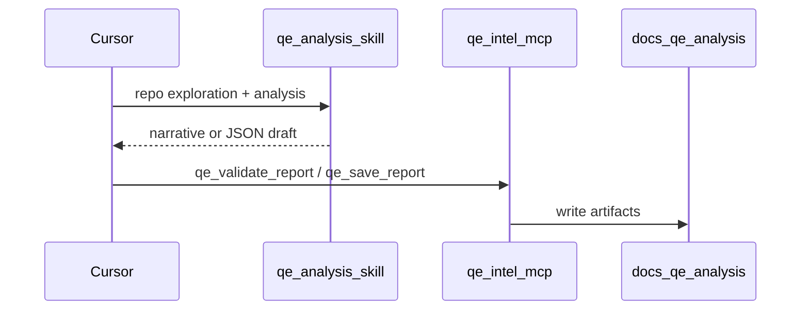

# QE Intelligence Suite

Structured Senior QE analysis in Cursor: backlog refinement, sprint UAT, ticketless repo UAT, bug triage, and regression — with a consistent **11-section**, risk-first output contract.

**Live showcase:** portfolio page at `/qe-intelligence-suite` (e.g. `https://<your-domain>/qe-intelligence-suite` when deployed).

## Trust-first default

| | Playwright MCP | **QE MCP (default)** |
|--|----------------|----------------------|
| LLM inside the server | No | **No** |
| API key in MCP config | No | **No** |
| What MCP does | Browser / DOM tools | Validate JSON, evidence guards, HTML, local save |
| Who writes the QE narrative | IDE agent | **IDE agent** (`qe-analysis` skill) |

**Install story:** Use the **`qe-analysis` skill** in Cursor for analysis and repo exploration. Connect **QE Intel MCP** (`qe-intel-mcp`) for the same artifact contract (schema, guards, tabbed HTML) **without** a second cloud LLM call from the server.

**Data handling:** See **[`docs/data-handling.md`](docs/data-handling.md)** — what stays local vs what goes to your IDE provider.

| Layer | What it is |
|-------|------------|
| **This repo** | `qe-intel-mcp` — stdio MCP server, sanitized system prompt (`PROMPT_VERSION`: `skill-v2-evidence-json`), writes to `docs/qe-analysis/` |
| **Analysis (recommended)** | Cursor **`qe-analysis` skill** — run analysis in your IDE thread with native repo exploration |
| **MCP server** | Deterministic tools: prompt/schema helpers, validate, envelope, render, save — **no API key** |
| **Not included** | Hosted MCP endpoint, shared API keys, in-server LLM calls, or automatic repo crawling (the IDE agent explores; MCP does not read the tree on its own) |

**This server does not call any external LLM API.**

## MCP tools

| Tool | Needs API key? |
|------|----------------|
| `qe_get_system_prompt` | No |
| `qe_get_json_schema` | No |
| `qe_validate_report` | No |
| `qe_save_report` | No |
| `qe_save_markdown` | No |

There is **no** in-server analysis path (no `qe_uat`-style one-shot generation, no Anthropic BYOK). Full QE depth comes from the skill + these tools.

## Architecture



## Quickstart

**Requirements:** Node 22+ (for `node --env-file` and built-in test runner).

### Install via npx (published package)

After [`qe-intel-mcp` is on npm](https://www.npmjs.com/package/qe-intel-mcp), add to `~/.cursor/mcp.json`:

```json
{
  "mcpServers": {
    "qe-intel": {
      "command": "npx",
      "args": ["-y", "qe-intel-mcp@latest"],
      "env": {
        "REPO_ROOT": "/ABSOLUTE/PATH/to/your/target-repo"
      }
    }
  }
}
```

Restart Cursor. **No API keys.**

**Migrating from `qe-refinement`:** rename the MCP key to `qe-intel` and use `qe-intel-mcp@latest` in `args`. Tool names (`qe_validate_report`, etc.) are unchanged.

### Install the skill (`init`)

```bash
npx qe-intel-mcp init
# team repo: npx qe-intel-mcp init --project /absolute/path/to/repo
# preview:  npx qe-intel-mcp init --dry-run
```

Copies the bundled **`qe-analysis`** skill into `~/.cursor/skills/qe-analysis/` (or the project’s `.cursor/skills/`). Restart Cursor again.

**Example prompts** (skill + MCP): [`qe-intel-mcp/README.md`](qe-intel-mcp/README.md#invoke-qe-via-skill--mcp-examples).

### Install from source (this repo)

```bash
cd qe-intel-mcp
npm install
npm run build
test -f dist/server.js && echo "Build OK"
```

Optional: `REPO_ROOT=/absolute/path/to/target-repo` so analyses save under that repo’s `docs/qe-analysis/` (defaults to process cwd).

### Cursor MCP — local clone (`~/.cursor/mcp.json`)

Use **absolute paths** on your machine. **No API keys.**

```json
{
  "mcpServers": {
    "qe-intel": {
      "command": "node",
      "args": [
        "/ABSOLUTE/PATH/qe-intelligence-suite/qe-intel-mcp/dist/cli.js"
      ],
      "env": {
        "REPO_ROOT": "/ABSOLUTE/PATH/to/your/target-repo"
      }
    }
  }
}
```

Restart Cursor after saving.

Publish checklist for maintainers: [`qe-intel-mcp/README.md`](qe-intel-mcp/README.md#publishing-maintainers).

**Local dev** (stdio):

```bash
cd qe-intel-mcp && npm run dev
```

### Hybrid agent runbook (skill + MCP)

Inference runs in **Cursor**; MCP only validates, guards, renders, and saves. The MCP process does **not** read your repository — you explore with grep/read and pass citations in tool arguments.

| Step | Owner | Action |
|------|--------|--------|
| 1 | Cursor agent | Explore the repo (routes, handlers, flags, tests). For `REPO_UAT` or multi-repo scope, follow the skill’s multi-repo scan strategy. |
| 2 | Cursor agent | Build `evidence_context`: bulleted `path:line — finding` citations (not file dumps; max ~10k chars). Redact secrets. |
| 3 | MCP (optional) | `qe_get_system_prompt` with `mode`, `output_format` (`markdown` \| `json`), and `related_repos` / `scope_unknown` when applicable. For JSON, also call `qe_get_json_schema`. |
| 4 | Cursor agent | Produce the full analysis in the thread (markdown sections 1–11 **or** a single JSON object per schema). Ground scenarios in evidence; label unverified items `Assumed:`. |
| 5 | MCP (JSON only) | `qe_validate_report` with `report_json` + validation context (`evidence_context`, `feature`, `existing_coverage`, etc.). Fix Zod/guard errors and re-validate until success. |
| 6 | MCP | **JSON:** `qe_save_report` with the validated `envelope` → sibling `.json` + tabbed `.html`. **Markdown:** `qe_save_markdown` with `body` → `.md` only. |
| 7 | Cursor agent | Reply with relative paths, confidence, risk count, GO/NO-GO when UAT/REPO_UAT, and any `validationWarnings`. |

**REPO_UAT:** same flow; set `mode: REPO_UAT`, `output_format: json` when you want envelope + HTML, and never cite paths you did not actually read in the workspace.

**Obsolete:** one-shot tools such as `qe_repo_uat` with in-server generation — removed. Do not add `ANTHROPIC_MODEL`, `MAX_TOKENS`, or API keys to MCP config; there is no Anthropic (or other) LLM call inside this server.

### Output artifact table

| `output_format` | Files written (`save_file=true`) | MCP chat body |
|-----------------|----------------------------------|---------------|
| `markdown` (default) | `docs/qe-analysis/qe-analysis-{MODE}-{slug}-{date}.md` only | Full markdown or summary + `Saved to:` footer |
| `json` | Same stem: `.json` (envelope) + `.html` — **no** `.md` | Short summary (mode, confidence, risks, scenario counts) + paths — not full HTML |
| JSON parse/validate failure | Optional `.raw.txt` only if wired — not default | Error list + path to raw file when saved |

Collision suffix (`-2`, `-3`) applies to the **stem** before extension; sibling `.json` and `.html` share one stem.

Regenerate committed v2 samples after schema or renderer changes:

```bash
cd qe-intel-mcp && npm run build && node scripts/write-v2-samples.mjs
```

### Skill vs MCP prompt (v1 / v2 divergence)

| | Cursor **`qe-analysis` skill** | **`qe-intel-mcp`** |
|--|-------------------------------|-------------------------|
| Primary deliverable | Markdown sections 1–11 (default) | Same contract; optional **JSON envelope** + tabbed **HTML** |
| Repo access | IDE grep/read | **None** — only `evidence_context` and other tool args you pass |
| Prompt source | Skill body + optional `qe_get_system_prompt` | Chunked prompts under `src/core/prompts/` (`PROMPT_VERSION`: `skill-v2-evidence-json`) |
| Section 5 table | **Evidence** and **Confidence** columns (v2 skill) | JSON `scenarios[].evidence` + `confidence`; markdown chunk mirrors table |
| Multi-repo / REPO_UAT | Sections 11a–11b, GO/NO-GO in prose | JSON: `repoCandidates`, `repoLedger`, `goNoGo`, `repoSelfCritique`, `droppedScenarios` |
| Auto `.md` from JSON | N/A | **Not** generated in v2 — one renderer path per format |

Keep the skill and MCP chunks aligned when you change analysis rules: update `~/.cursor/skills/qe-analysis/SKILL.md`, mirror in `qe-intel-mcp/src/core/prompts/`, and bump `PROMPT_VERSION` in `src/core/constants.ts`. Portfolio samples may still show v1 Markdown under `samples/` while v2 JSON/HTML live under `samples/v2/`.

## Sample outputs

Committed examples (sanitized, fictional scope):

**v1 — Markdown** ([`docs/qe-analysis/samples/`](docs/qe-analysis/samples/)):

- [REFINEMENT — promo code at checkout](docs/qe-analysis/samples/qe-analysis-REFINEMENT-promo-code-checkout-2026-05-18.md)
- [UAT — checkout promo flow](docs/qe-analysis/samples/qe-analysis-UAT-checkout-promo-flow-2026-05-18.md)

**v2 — JSON envelope + tabbed HTML** ([`docs/qe-analysis/samples/v2/`](docs/qe-analysis/samples/v2/)) — hybrid validate/save path:

- [REFINEMENT — promo code at checkout (JSON)](docs/qe-analysis/samples/v2/qe-analysis-REFINEMENT-promo-code-at-checkout-2026-05-21.json) · [HTML](docs/qe-analysis/samples/v2/qe-analysis-REFINEMENT-promo-code-at-checkout-2026-05-21.html)
- [UAT — checkout promo flow (JSON)](docs/qe-analysis/samples/v2/qe-analysis-UAT-checkout-promo-flow-2026-05-21.json) · [HTML](docs/qe-analysis/samples/v2/qe-analysis-UAT-checkout-promo-flow-2026-05-21.html)

Open the `.html` files in a browser for the tabbed report (includes `validationWarnings` banner when guards fire).

## Environment variables

| Variable | Required? | Purpose |
|----------|-----------|---------|
| `REPO_ROOT` | No | Absolute path to the repo where `docs/qe-analysis/` should be written (defaults to MCP process cwd) |

There are **no** `ANTHROPIC_MODEL`, `ANTHROPIC_MAX_TOKENS`, or API-key variables for this server — model choice and token limits are entirely your **IDE agent’s** provider. See [`.env.example`](qe-intel-mcp/.env.example).

## Prompt hygiene

Prompts and the bundled skill should stay **vendor-neutral** (no employer-specific product names). When the skill changes, update `skills/qe-analysis/SKILL.md`, mirror rules in `qe-intel-mcp/src/core/prompts/`, run `npm run sync-skill` if edited in `~/.cursor/skills/`, and bump `PROMPT_VERSION` in `src/core/constants.ts`.

## Relation to portfolio demos

| Demo | Role |
|------|------|
| **QE Intelligence Suite** (this repo) | IDE skill for analysis; MCP for local validate/save (no cloud LLM in server) |
| **QE assistant** (`/qe-assistant`) | Browser chat; server-side API key on Vercel |
| **QE showcase** (`/qe-showcase`) | Strategy narrative + links to other demos |
| **CI dashboard** (`/ci-dashboard`) | Pipeline observability sample / Supabase ingest |
