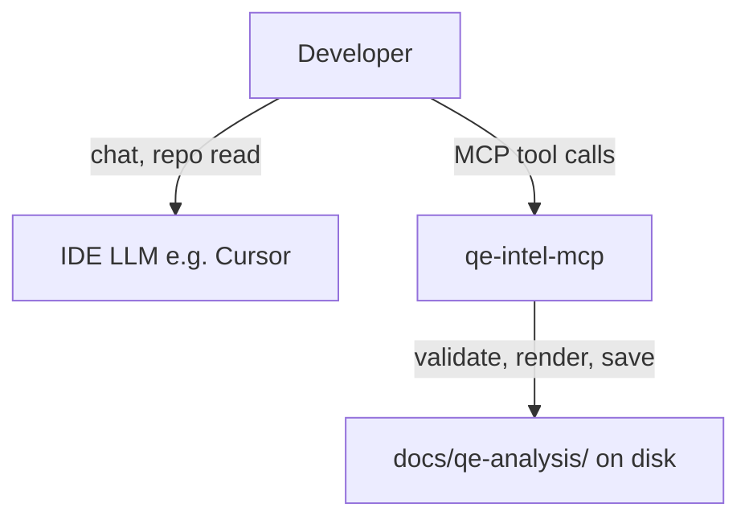

# Data handling and privacy

This page explains **what leaves your machine** when you use QE Intelligence Suite, so security and compliance reviewers can approve or reject the workflow in one read.

**Short answer:** The MCP server does **not** call any external LLM API. Analysis runs in your IDE (Cursor skill); MCP validates JSON, renders HTML, and writes files **locally**. You do **not** need an Anthropic or other model API key for MCP.

**Honest caveat:** Repo exploration and report **generation** still use your IDE’s AI assistant. That is a separate data path governed by your IDE vendor (e.g. Cursor), not by this MCP process.

---

## Data flow

| Step | Who runs it | API key in MCP? | Network from MCP server? |
|------|-------------|-----------------|---------------------------|
| Repo exploration + QE coaching | IDE agent + `qe_intel_*` skills | No | No (IDE vendor handles chat) |
| Guided playbook + repo scan hints | MCP `qe_intel_*` (local rg/walk under `REPO_ROOT`) | No | **No** |
| Validate, envelope, HTML, save (optional) | MCP Phase E tools | No | **No** |

---

## What the MCP server does

The stdio MCP server (`qe-intel-mcp`) registers **deterministic** tools only:

| Tool | Purpose | Data leaves MCP process? |
|------|---------|----------------------------|
| `qe_intel_*` | Phased QE playbook + optional repo path hints (local scan) | No network; stdio only |
| `qe_intel_review` | Plain-language draft critique | No network |
| `qe_get_system_prompt` | Full senior prompt (Phase E / debug) | No network |
| `qe_get_json_schema` | JSON schema description | No network |
| `qe_validate_report` | Parse, Zod validate, evidence guards, envelope | No network |
| `qe_save_report` | Write `.json` + tabbed `.html` | Local disk only |
| `qe_save_markdown` | Write markdown | Local disk only |

The server **does not**:

- Full-repository indexing (light filename/rg hints under `REPO_ROOT` only)
- Call Anthropic, OpenAI, or any other model API
- Host a shared API key or relay traffic through maintainer infrastructure
- Offer legacy one-shot `qe_uat` / `qe_refinement` tools that generate reports in-server

The server **does**:

- Process whatever your IDE agent passes in tool arguments (over the MCP stdio channel, on your machine)
- Optionally write artifacts under `REPO_ROOT/docs/qe-analysis/` (default: current working directory)

### What can appear in MCP tool arguments

Your IDE agent controls the payload. Typical fields:

| Field | Source | Sensitivity notes |
|-------|--------|-------------------|
| `report_json` | Agent-generated structured report | May contain scenario text, citations, ticket quotes |
| `feature`, `title`, `mode` | User / agent | Ticket IDs, feature names |
| `api_context`, `system_context`, `user_context` | User / agent | Architecture, endpoints, AC text |
| `evidence_context` | Agent summaries from repo read (max 10k chars) | Often `path:line — finding` citations; **can** include snippets if the agent pasted them |
| `envelope` | Output of `qe_validate_report` | Same as validated report |

There is **no second model vendor** inside MCP — only your IDE provider for generation.

### What goes to your IDE LLM

When you follow the **`qe-analysis` skill** (recommended), the Cursor (or other) agent:

- Reads files in the workspace via IDE tools
- Produces narrative or JSON analysis in the **chat thread**

That content is handled under **your IDE provider’s** terms, retention, and enterprise agreement — the same as any coding assistant. This repo does not control that path.

**Enterprise nuance:** Many teams already approve Cursor for source-aware assistance. QE Intelligence Suite adds **local** validation and artifacts without a **second** cloud LLM call from the MCP server.

We do **not** claim “runs fully locally” or “your code never leaves your machine” when IDE analysis is in use — only that **MCP does not add another cloud inference hop**.

---

## Data minimization (recommended)

When using the skill and MCP validate/save:

1. **Citations, not dumps** — Prefer `src/api/promo.ts:42 — POST handler` per line in `evidence_context`, not whole files.
2. **Redact secrets** — Never paste `.env`, tokens, passwords, or live customer PII into tool args or chat.
3. **Ticket hygiene** — Paste only AC and scope needed for QE; avoid unrelated backlog noise.
4. **Assumed vs code** — Label hypotheses `Assumed:` so guards and reviewers can spot uncited claims.
5. **Save locally on purpose** — `docs/qe-analysis/` files may be committed; review before `git push`.

Evidence rules embedded in prompts match these practices; see `qe-intel-mcp/src/core/prompts/evidence-rules.ts`.

---

## Comparison: Playwright MCP vs QE MCP

| | [Playwright MCP](https://github.com/microsoft/playwright-mcp) | QE MCP |
|--|-------------------------------|--------|
| LLM inside server | No | No |
| User API key in server | No | No |
| Primary role | Browser automation tools | Validate, envelope, HTML, save |
| Primary output | DOM / accessibility snapshots | QE reports on disk |
| Repo access | Via IDE agent | Via IDE agent only (not MCP crawl) |
| “Another AI vendor” fear | Low — automation helper | Low — quality infrastructure |

Playwright returns **page state**; QE MCP returns **validated artifacts**. In both cases the **IDE model** does the reasoning.

---

## Skill-only vs MCP-assisted

| Approach | MCP API key? | Artifacts |
|----------|--------------|-----------|
| **Skill only** | No | Markdown in chat / manual save |
| **Skill + MCP (recommended)** | No | Guided `qe_intel_*` runs; optional validated JSON/HTML |

**Lead with `qe_intel_*`** for coaching; Phase E save is optional.

---

## Environment variables

| Variable | Purpose |
|----------|---------|
| `REPO_ROOT` | Optional — target repo for `docs/qe-analysis/` (defaults to cwd) |

See [`qe-intel-mcp/.env.example`](../qe-intel-mcp/.env.example).

---

## Maintainer commitments

- **No hosted inference** — This repo does not operate a shared model endpoint.
- **No in-server LLM path** — MCP will not call Anthropic or similar APIs; analysis stays in the IDE.
- **No covert exfiltration** — Shipped MCP has no outbound model HTTP client in its dependency set.

Questions or corrections: open an issue in the repository with the label `security` / `privacy` if available.

---

## Related reading

- [README](../README.md) — install, Playwright comparison, tool table
- [`qe-intel-mcp`](../qe-intel-mcp/) — server source
- Sample outputs: [`docs/qe-analysis/samples/`](qe-analysis/samples/)
