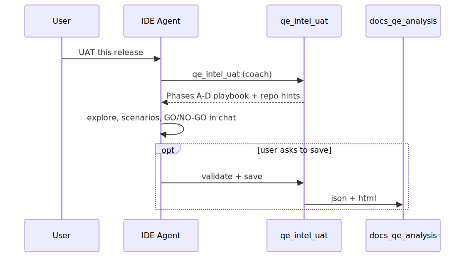

# QE Craft MCP (`@qe-craft/mcp`)

**Guided QE in your copilot** — phased playbooks for people who are not full-time QEs. **No API key.** Inference stays in Cursor; MCP returns the director's script and optional artifact save.

Pair with **seven Cursor skills** (`npx @qe-craft/mcp init`): router + five mode skills + `qe-automate` for test writing.

## Requirements

- Node.js **22+**
- Cursor (stdio MCP)

## Quick setup

### 1. MCP — `~/.cursor/mcp.json`

```json
{
  "mcpServers": {
    "qe-craft": {
      "command": "npx",
      "args": ["-y", "@qe-craft/mcp@latest"],
      "env": {
        "REPO_ROOT": "/absolute/path/to/your/target-repo"
      }
    }
  }
}
```

### 2. Skills

```bash
npx @qe-craft/mcp init
# team: npx @qe-craft/mcp init --project /absolute/path/to/your-repo
npx @qe-craft/mcp@latest init --force   # upgrade
```

Installs: `qe-analysis`, `qe-refinement`, `qe-uat-gate`, `qe-repo-charter`, `qe-incident`, `qe-regression-impact`, `qe-automate`.

### 3. Restart Cursor

| Variable | Purpose |
|----------|---------|
| `REPO_ROOT` | Repo for scan hints + `docs/qe-analysis/` writes |

---

## Trust-first default

- **No LLM in the MCP server** — `qe_intel_*` guided runs and optional validate/save only.
- **No API key in MCP config** — QE reasoning stays in your IDE agent (skills + phased playbook).
- **Coach-first** — better QE in chat by default; files only when you ask.

**Data handling:** See **[`../docs/data-handling.md`](../docs/data-handling.md)**.

**This server does not call any external LLM API.**

---

## MCP tools

**Primary (start here):**

| Tool | Purpose |
|------|---------|
| `qe_intel_refinement` | Guided story grooming |
| `qe_intel_uat` | Guided release gate |
| `qe_intel_repo_uat` | Guided repo charter |
| `qe_intel_bug` | Guided incident analysis |
| `qe_intel_regression` | Guided retest scope |
| `qe_intel_review` | Draft quality check |


No API key. Coach-tier success = better QE in chat, not a file on disk.

---

## Architecture

Coach-tier UAT example: MCP returns the phased playbook; Cursor explores the repo and reasons in chat. Save to disk only when asked.

<p align="center">
  
</p>

<p align="center"><sub>Regenerate from <code>docs/architecture.mmd</code> with <code>npx -y @mermaid-js/mermaid-cli -i docs/architecture.mmd -o docs/architecture.svg -b transparent</code></sub></p>

---

## Example (UAT — coach)

Paste in chat:

```text
Use qe-uat-gate. Call qe_intel_uat with:

feature: Release 2.4 — checkout promo ready for prod
release: { "rollback": "revert flag checkout.promo_v2", "monitoring": "promo_apply_failure_reason metric" }

Explore the repo, execute Phases A–D from the tool response, give GO/NO-GO in chat.
Do not save files unless I ask.
```

**Agent should:** one `qe_intel_uat` call → follow phases → optional `qe_intel_review` → save only on request.

---

## Guided run (default)

| Step | Owner | Action |
|------|--------|--------|
| 1 | Cursor | Match intent → skill → **`qe_intel_<mode>`** with ticket/context (`output_tier: coach`) |
| 2 | MCP | Return phased playbook (A–D), repo **where to look** hints under `REPO_ROOT`, input gaps if thin |
| 3 | Cursor | Execute phases in chat — questions, risks, scenario table, GO/NO-GO / AC gaps |
| 4 | Cursor (optional) | **`qe_intel_review`** on draft |
| 5 | MCP (optional) | Phase E: validate + save only if user wants files |

See `skills/shared/intel-run.md`. Full 11-section / JSON contract: `output_tier: full` + `artifact-run.md`.

### Output artifact table

| `output_format` | Files written (`save_file=true`) | MCP chat body |
|-----------------|----------------------------------|---------------|
| `markdown` (default) | `docs/qe-analysis/qe-analysis-{MODE}-{slug}-{date}.md` only | Full markdown or summary + `Saved to:` footer |
| `json` | Same stem: `.json` (envelope) + `.html` — **no** `.md` | Short summary (mode, confidence, risks, scenario counts) + paths — not full HTML |
| JSON parse/validate failure | Optional `.raw.txt` only if wired — not default | Error list + path to raw file when saved |

Collision suffix (`-2`, `-3`) applies to the **stem** before extension; sibling `.json` and `.html` share one stem.

Regenerate committed v2 samples after schema or renderer changes:

```bash
cd mcp && npm run build && node scripts/write-v2-samples.mjs
```

---

## Artifact tools (Phase E only)

| Tool | Purpose |
|------|---------|
| `qe_validate_report` | JSON + evidence guards |
| `qe_save_report` | `.json` + `.html` |
| `qe_save_markdown` | `.md` |
| `qe_get_system_prompt` | Debug / full-tier rules |

See `skills/shared/artifact-run.md` in this package.

---

## Environment variables

| Variable | Required? | Purpose |
|----------|-----------|---------|
| `REPO_ROOT` | No | Absolute path to the repo where `docs/qe-analysis/` should be written (defaults to MCP process cwd) |

There are **no** `ANTHROPIC_MODEL`, `ANTHROPIC_MAX_TOKENS`, or API-key variables for this server — model choice and token limits are entirely your **IDE agent's** provider. See [`.env.example`](.env.example).

---

## Install from source (this repo)

```bash
cd mcp
npm install
npm run build
test -f dist/server.js && echo "Build OK"
```

Optional: `REPO_ROOT=/absolute/path/to/target-repo` so analyses save under that repo's `docs/qe-analysis/` (defaults to process cwd).

### Cursor MCP — local clone (`~/.cursor/mcp.json`)

Use **absolute paths** on your machine. **No API keys.**

```json
{
  "mcpServers": {
    "qe-craft": {
      "command": "node",
      "args": [
        "/ABSOLUTE/PATH/qe-craft/mcp/dist/cli.js"
      ],
      "env": {
        "REPO_ROOT": "/ABSOLUTE/PATH/to/your/target-repo"
      }
    }
  }
}
```

Restart Cursor after saving.

**Local dev** (stdio):

```bash
cd mcp && npm run dev
```

---

## Prompt hygiene

Prompts and bundled skills should stay **vendor-neutral** (no employer-specific product names). When coaching rules change, update `src/intel/` and `src/core/prompts/`, sync skills under `skills/`, run `npx @qe-craft/mcp init --force`, and bump `PROMPT_VERSION` in `src/core/constants.ts`.

---

## Publishing (maintainers)

1. `cd mcp && npm run pack:check` — dry-run pack after build + tests.
2. Confirm version in `package.json` and changelog intent.
3. `npm login` (org **`qe-craft`** for scoped publish).
4. `npm publish --access public` from `mcp/` (`prepublishOnly` runs `check` + `test`).
5. Smoke: `npx @qe-craft/mcp@latest init --dry-run` and connect MCP in Cursor as `qe-craft`.

---

## Develop

```bash
npm install && npm run check && npm test
```

## Built by

An SDET actively piloting contract testing and AI-assisted QE workflows in production — not a theoretical implementation.

[Portfolio](https://www.arjunjhawar.dev)
