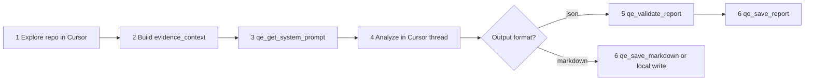

# QE Intel — legacy utility runbook

**Primary flow:** [intel-run.md](./intel-run.md) — start with **`qe_intel_*`** tools.

This file documents the **Phase E / debug** utilities (`qe_get_system_prompt`, `qe_validate_report`, etc.). No API key required.

**Important:** The MCP server does **not** read the repository. Only the Cursor agent explores via grep/read and passes citations in tool arguments.



## 1 — Explore the repository (Cursor only)

Before analysis, gather **evidence** in the workspace(s):

- Read routes, handlers, flags, tests, configs relevant to the mode and feature area.
- For `REPO_UAT` or multi-repo scope: follow the skill’s **Multi-repo scan strategy** (lead unit deep, satellites shallow).
- For `SCOPE_UNKNOWN: true`: run the **Inference ladder** and record candidates for section 11.

**Do not** ask MCP to crawl the repo or assume it has filesystem access.

## 2 — Build `evidence_context`

Summarize findings as **citations**, not file dumps — one finding per line, e.g.:

```
src/api/promo.ts:42 — POST /checkout/promo handler
apps/checkout/routes.ts:18 — promo field on checkout page
tests/checkout/promo.test.ts:12 — no concurrent redemption case
```

Rules:

- Prefer `path:line — short finding` bullets; stay under the MCP limit (~10k characters).
- **Redact** secrets; never paste `.env`, tokens, or credentials into tool args.
- Pass the same bundle (or subset) to `qe_validate_report` as `evidence_context` so evidence guards can match scenario citations.

Also map user input into validation context fields when you validate/save: `feature`, `api_context`, `system_context`, `user_context`, `repo_hints`, `related_repos`, `existing_coverage` (from the skill input template).

## 3 — Get the system prompt (optional but recommended)

Call **`qe_get_system_prompt`** with:

| Argument | Value |
|----------|--------|
| `mode` | `REFINEMENT`, `UAT`, `REPO_UAT`, `BUG`, or `REGRESSION` (fixed per skill) |
| `output_format` | `markdown` or `json` (per skill default or user choice) |
| `related_repos` | Optional — paste `RELATED_REPOS` / `SYSTEM_MAP` table or short form |
| `scope_unknown` | `true` when input includes `SCOPE_UNKNOWN: true` |

Alternatively, use the **embedded instructions in the skill** for markdown — they align with the MCP prompt (`PROMPT_VERSION` in the tool response header).

For **JSON** output, also call **`qe_get_json_schema`** and follow its schema in the next step.

## 4 — Analyze in the Cursor thread

Perform the full Senior QE analysis **here** (not inside MCP):

- Apply **Role**, **Instructions**, and **Output Format** from the skill (markdown sections 1–11) or emit **JSON only** per `qe_get_json_schema` (no markdown fences, no commentary outside the JSON object).
- Ground scenarios in `evidence_context` and user input; label unverified items `Assumed:`.
- For markdown: produce sections **1–11** with exact `##` headings.
- For JSON: one object matching the schema; set `generated` to the run date (UTC `YYYY-MM-DD`).

## 5 — Validate (JSON path only)

Call **`qe_validate_report`** with:

- `report_json` — the raw JSON string from step 4.
- Validation context: `feature`, `evidence_context`, and any of `api_context`, `system_context`, `user_context`, `repo_hints`, `related_repos`, `existing_coverage` that apply.

If validation **fails**: read the error list, fix the JSON (schema paths, evidence guards, dropped scenarios), and call **`qe_validate_report` again**. Do not call `qe_save_report` until validation succeeds.

On **success**, the tool returns a summary plus a **Validated envelope** JSON block — copy that envelope for the next step.

## 6 — Save artifacts

**JSON (validated envelope):** call **`qe_save_report`** with:

- `envelope` — the validated envelope from step 5.
- `mode` — same as analysis mode.
- `title` — short human title (from report or ticket).
- `save_file` — `false` only if the user opted out of files.

This writes sibling `.json` and tabbed `.html` under `docs/qe-analysis/` (naming handled by MCP). Tell the user both relative paths.

**Markdown:** either

- Call **`qe_save_markdown`** with `body` (full sections 1–11), `mode`, `title`, and `save_file`; or
- Write the file yourself under `docs/qe-analysis/` if MCP is unavailable.

Set `save_file: false` when the user requested chat-only / do not save.

**Filename pattern:** `qe-analysis-<MODE>-<slug>-YYYY-MM-DD.{md|json|html}` — append `-2`, `-3`, etc. on collision.

**Opt-out phrases (no file):** *chat only*, *do not save*, *no file*, *in this thread only*.

## 7 — Reply in chat

Always include:

- Relative path(s) to saved artifacts under `docs/qe-analysis/`.
- A short summary (confidence, risk count, GO/NO-GO if UAT/REPO_UAT).
- For JSON: note any `validationWarnings` from the validate/save summary.

## MCP limitations (state honestly)

| Claim | Allowed? |
|-------|----------|
| "I read `src/...` in the repo" | Yes — **Cursor** exploration only |
| "MCP scanned the repository" | **No** — MCP only receives what you pass in args |
| "Evidence was verified in workspace" | Yes, when you actually read/grepped those paths |
| Paths in scenarios without workspace access | Mark `blocked` in section 11 / `assumed` evidence type |

## Opt-in strict pipeline (not default)

If the user enabled **`QE_STRICT_PIPELINE=true`** and **`ANTHROPIC_API_KEY`**, legacy one-shot tools (`qe_refinement`, `qe_uat`, etc.) may run inference inside MCP. **Default installs should use this runbook instead** — one IDE thread, no second cloud vendor. Do not suggest BYOK unless the user explicitly wants a fixed remote model and accepts data egress to Anthropic.
