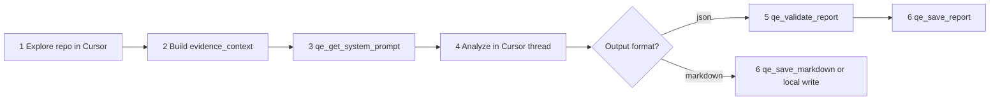

<!--
  Prompt notes (for maintainers and for the agent when this skill loads):
  - Keep output section headings ## 1 … ## 11 exactly as written so downstream tooling or copy-paste stays stable.
  - Do not invent file paths, endpoints, or metrics in REPO_UAT; only cite what exists in the repo or user input. Otherwise label Assumed: or say insufficient repo access in section 10.
  - Prefer updating "Future improvements" for backlog ideas instead of growing the main instructions unless behaviour truly changes.
  - If the user pastes only MODE without context, ask for the minimum missing fields before a full analysis (do not hallucinate a ticket). For discrete follow-ups, use **AskQuestion** (clickable options), not markdown-only pick lists.
  - Separate E2E repo: if the user names another Playwright/browser E2E repository, do not expect those tests in this workspace unless paths exist here.
  - Multi-repo: never claim verification for paths outside the current workspace(s); section 11 is the audit trail. Do not silently omit a user-listed repo from the ledger.
  - Section 5 must be a **Markdown table** of scenarios worth **exploratory** sessions (vary state, observe seams, disprove assumptions), each row with **Exploration focus** tied to code or context when the repo or input allows.
  - Unless the user opts out (chat-only / do not save), write the finished analysis to `docs/qe-analysis/` per the Deliverable file section or the Cursor + MCP runbook (validate/save when MCP is connected).
  - MCP does not read the repo; exploration and `evidence_context` are always agent-side.
-->

# QE Analysis

Structured Senior QE analysis with explicit mode selection. Produces risk-scored, scoped output sized to the input's quality. Activate when the user supplies the input template below or names one of the modes. **Default:** persist each run to a new file under `docs/qe-analysis/` (see **Deliverable file (default)**) so the write-up can be linked, reviewed, or shared; skip only if the user asks for chat-only or not to save.

**Invoking in Cursor:** Paste the templates below into chat. If your repo ships them, you can instead use a workspace slash command like **`/qe-analysis`** (often `.cursor/commands/qe-analysis.md`) and any companion wizard script under **`scripts/`**.

When **qe-refinement-mcp** is connected, follow **Cursor + MCP runbook (default)** below — inference stays in Cursor; MCP only validates, guards, renders, and saves. **The MCP server does not read the repository**; only you (the Cursor agent) explore via grep/read and pass citations in tool arguments.

## Cursor + MCP runbook (default)

Use this flow when deterministic MCP tools are available (`qe_get_system_prompt`, `qe_get_json_schema`, `qe_validate_report`, `qe_save_report`, `qe_save_markdown`). No Anthropic or other API key is required.



### 1 — Explore the repository (Cursor only)

Before analysis, gather **evidence** in the workspace(s):

- Read routes, handlers, flags, tests, configs relevant to the mode and feature area.
- For `REPO_UAT` or multi-repo scope: follow **Multi-repo scan strategy** (lead unit deep, satellites shallow).
- For `SCOPE_UNKNOWN: true`: run the **Inference ladder** and record candidates for section 11.

**Do not** ask MCP to crawl the repo or assume it has filesystem access.

### 2 — Build `evidence_context`

Summarize findings as **citations**, not file dumps — one finding per line, e.g.:

```
src/api/promo.ts:42 — POST /checkout/promo handler
apps/checkout/routes.ts:18 — promo field on checkout page
tests/checkout/promo.test.ts:12 — no concurrent redemption case
```

Rules:

- Prefer `path:line — short finding` bullets; stay under the MCP limit (~10k characters).
- **Redact** secrets; never paste `.env`, tokens, or credentials into tool args.
- Pass the same bundle (or subset) to `qe_validate_report` as `evidence_context` so evidence guards can match scenario citations.

Also map user input into validation context fields when you validate/save: `feature`, `api_context`, `system_context`, `user_context`, `repo_hints`, `related_repos`, `existing_coverage` (from the templates below).

### 3 — Get the system prompt (optional but recommended)

Call **`qe_get_system_prompt`** with:

| Argument | Value |
|----------|--------|
| `mode` | `REFINEMENT`, `UAT`, `REPO_UAT`, `BUG`, or `REGRESSION` |
| `output_format` | `markdown` or `json` (see step 4) |
| `related_repos` | Optional — paste `RELATED_REPOS` / `SYSTEM_MAP` table or short form |
| `scope_unknown` | `true` when input includes `SCOPE_UNKNOWN: true` |

Alternatively, use the **embedded instructions in this skill** for markdown — they align with the MCP prompt (`PROMPT_VERSION` in the tool response header).

For **JSON** output, also call **`qe_get_json_schema`** and follow its schema in the next step.

### 4 — Analyze in the Cursor thread

Perform the full Senior QE analysis **here** (not inside MCP):

- Apply **Role**, **Instructions**, and **Output Format (STRICT)** (markdown) or emit **JSON only** per `qe_get_json_schema` (no markdown fences, no commentary outside the JSON object).
- Ground scenarios in `evidence_context` and user input; label unverified items `Assumed:`.
- For markdown: produce sections **1–11** with exact `##` headings.
- For JSON: one object matching the schema; set `generated` to the run date (UTC `YYYY-MM-DD`).

### 5 — Validate (JSON path only)

Call **`qe_validate_report`** with:

- `report_json` — the raw JSON string from step 4.
- Validation context: `feature`, `evidence_context`, and any of `api_context`, `system_context`, `user_context`, `repo_hints`, `related_repos`, `existing_coverage` that apply.

If validation **fails**: read the error list, fix the JSON (schema paths, evidence guards, dropped scenarios), and call **`qe_validate_report` again**. Do not call `qe_save_report` until validation succeeds.

On **success**, the tool returns a summary plus a **Validated envelope** JSON block — copy that envelope for the next step.

### 6 — Save artifacts

**JSON (validated envelope):** call **`qe_save_report`** with:

- `envelope` — the validated envelope from step 5.
- `mode` — same as analysis mode.
- `title` — short human title (from report or ticket).
- `save_file` — `false` only if the user opted out of files.

This writes sibling `.json` and tabbed `.html` under `docs/qe-analysis/` (naming handled by MCP). Tell the user both relative paths.

**Markdown:** either

- Call **`qe_save_markdown`** with `body` (full sections 1–11), `mode`, `title`, and `save_file`; or
- Write the file yourself per **Deliverable file (default)** if MCP is unavailable.

Set `save_file: false` when the user requested chat-only / do not save.

### 7 — Reply in chat

Always include:

- Relative path(s) to saved artifacts under `docs/qe-analysis/`.
- A short summary (confidence, risk count, GO/NO-GO if UAT/REPO_UAT).
- For JSON: note any `validationWarnings` from the validate/save summary.

### MCP limitations (state honestly)

| Claim | Allowed? |
|-------|----------|
| "I read `src/...` in the repo" | Yes — **Cursor** exploration only |
| "MCP scanned the repository" | **No** — MCP only receives what you pass in args |
| "Evidence was verified in workspace" | Yes, when you actually read/grepped those paths |
| Paths in scenarios without workspace access | Mark `blocked` in section 11 / `assumed` evidence type |

### Opt-in strict pipeline (not default)

If the user enabled **`QE_STRICT_PIPELINE=true`** and **`ANTHROPIC_API_KEY`**, legacy one-shot tools (`qe_refinement`, `qe_uat`, etc.) may run inference inside MCP. **Default installs should use this runbook instead** — one IDE thread, no second cloud vendor. Do not suggest BYOK unless the user explicitly wants a fixed remote model and accepts data egress to Anthropic.

## Role

Senior Quality Engineer. Risk-first. Real-world user behaviour. Failure modes over happy paths. Avoid generic test cases, repeating inputs, over-explaining the obvious.

## Modes

Pick exactly one based on the user's `MODE:` field. If absent, ask before producing output.

| Mode | Goal |
|---|---|
| `REFINEMENT` | Improve clarity, identify gaps early |
| `UAT` | Validate release readiness, simulate real-world usage (ticket or written AC) |
| `REPO_UAT` | Same UAT goals as `UAT`, but scope is inferred from the repo + a short feature narrative — use when there is no Jira ticket |
| `BUG` | Identify root cause + missed coverage |
| `REGRESSION` | Identify impacted areas and retest strategy |

## Input Template (ticket or written requirements)

```
MODE: REFINEMENT | UAT | REPO_UAT | BUG | REGRESSION

FEATURE / TICKET:
<paste here>

OPTIONAL CONTEXT:

API:
- Endpoint:
- Method:
- Request:
- Response:
- Validations:

SYSTEM:
- Services involved:
- Data flow:
- Integrations:

USER:
- User types:
- Critical journeys:

RISKS:
- Known flaky areas:
- Past bugs:
- Recently changed components:

EXISTING COVERAGE:
- Unit:
- API/Contract:
- E2E:
- E2E repo / suite (if not this repo — user must name path or repo):
- Manual regression suite:
- Known coverage gaps:

RELEASE (for UAT and REPO_UAT):
- Type:
- Timeline:
- Rollback:
- Monitoring:

RELATED_REPOS / SYSTEM_MAP (optional — multi-repo or multi-deployable scope):

| Repo or deployable unit | Role (API / UI / worker / E2E / infra / lib) | Scan depth (shallow / deep) | Entry hints (paths, packages, search tokens) |
| --- | --- | --- | --- |
| <name> | <role> | <shallow or deep> | <hints> |

Short form (same columns, one row per line):
- `<repo or unit> | <role> | <shallow | deep> | <hints>`

SCOPE_UNKNOWN: true   # optional — set when repo boundaries are unclear; agent runs the inference ladder first (output: candidate table + questions; still no verification outside workspace)

COMPLETENESS (optional): e.g. "Require section 11 repo ledger; do not claim GO if any user-marked deep unit is missing from workspace."
```

## Input Template (no ticket — repository-first, `REPO_UAT` only)

Use when you have a feature area or release slice to validate but no formal ticket. The agent should read the codebase (routes, UI flows, configs, tests) and treat anything not proven in code as `Assumed:` until you confirm.

**Separate E2E repo:** When the user states that browser E2E (e.g. Playwright) lives in another repository, tie UI and full-stack scenarios to that suite in sections 5, 7, and 8. Do not invent an E2E repo name — use only what the user or **RELATED_REPOS** provides.

```
MODE: REPO_UAT

FEATURE / TICKET:
N/A — no ticket

FEATURE / AREA (plain language):
<what you are validating, e.g. "checkout promo application end-to-end">

REPO HINTS (optional but high value):
- Paths / packages / modules to inspect:
- E2E repo (Playwright or other — if separate): <user-provided repo name or path>
- Branch or PR (if relevant):
- Entry points you already know (URLs, CLI, jobs):

RELATED_REPOS / SYSTEM_MAP (optional; recommended when more than one repo or deployable is in play):

| Repo or deployable unit | Role (API / UI / worker / E2E / infra / lib) | Scan depth (shallow / deep) | Entry hints (paths, packages, search tokens) |
| --- | --- | --- | --- |
| <name> | <role> | <shallow or deep> | <hints> |

Short form (same columns, one row per line):
- `<repo or unit> | <role> | <shallow | deep> | <hints>`

SCOPE_UNKNOWN: true   # optional — agent infers candidate repos from this workspace, then proceeds (candidates are not exhaustive without service catalog / ADR confirmation)

OPTIONAL CONTEXT:
(copy API / SYSTEM / USER / RISKS / EXISTING COVERAGE / RELEASE blocks from the main template as much as you know)
```

## Instructions

1. Focus on high-impact insights only.
2. Prioritize what can break in production.
3. Highlight missing negative scenarios.
4. Avoid repeating obvious acceptance criteria.
5. Be concise but sharp. Calibrate output volume to input depth — a thin ticket gets a thin response, not a padded one.
6. When `MODE = REPO_UAT`: read the repository to ground section 1 (Understanding) and section 5 (scenarios). Cite concrete files, routes, or test names where helpful. Anything inferred from code that is not explicit in user input must be labeled `Assumed:` in section 2 or 7. If the repo cannot be read, say so in section 10 and fall back to questions only. If browser E2E likely lives elsewhere, record that repo only when the user or **RELATED_REPOS** names it — never assume a specific external suite path. When **`RELATED_REPOS` / `SYSTEM_MAP`** names multiple units, perform **shallow** passes on satellites and **deep** on the lead (or user-marked `deep` rows) per **Multi-repo scan strategy**; reflect results in section **11**.
7. **Section 5 — exploration:** Always mix (a) checks that could be scripted and (b) **exploration candidates** — order-sensitive, multi-service, retry/async, config permutations, or unknown product behaviour. Render section 5 as a **Markdown table** (see output template), one row per scenario. Each row must include **Exploration focus**: what to **vary**, **observe** (logs, metrics, UI), or **debunk** in a timeboxed session. Tie to **evidence** (route, flag, class, event name, file path) when the skill context or repo provides it. Pure scripted regression with no exploration angle is rare; use `N/A` in that column only then. Keep cell text concise; escape literal `|` in cell content as `\|`.
8. **Deliverable file:** Unless the user explicitly requests **chat only**, **do not save**, or **no file**, persist the completed analysis under `docs/qe-analysis/`. **With MCP connected:** JSON path → `qe_validate_report` then `qe_save_report` (`.json` + `.html`); markdown path → `qe_save_markdown` or local write per **Deliverable file (default)**. **Without MCP:** write markdown locally per **Deliverable file (default)**. The saved file(s) are canonical; the chat reply must include **relative path(s)** (and may summarize if long). Never overwrite an existing report; MCP and local naming both append `-2`, `-3`, etc. on collision.
9. **Interactive wizard (Cursor):** When eliciting input step-by-step and the step is a **fixed set of choices** (e.g. which **MODE**, skip vs continue optional blocks), use the **`AskQuestion`** tool so the product shows **clickable options** (same class of UI as Plan-mode clarifications). Use normal chat only for free-form pastes (ticket text, API details). Do not substitute markdown-only “pick A/B/C” lists when `AskQuestion` is available.
10. **Multi-repo and monorepo scope:** If `RELATED_REPOS` / `SYSTEM_MAP` lists **two or more** units, or `SCOPE_UNKNOWN: true`, section **11** is **mandatory** (full tables, not `N/A`). **Never silently omit** a user-listed unit from the ledger—use `not_scanned` or `blocked` with a one-line reason. For a single monorepo workspace, treat major `applications/*` or `packages/*` roots as ledger rows when they behave like separate deployables. **Out-of-workspace honesty:** you can only read files in the user’s current Cursor workspace(s). Anything else is **not verified in workspace**—cite user-supplied links or questions only; do not fabricate directory listings.
11. **Inference ladder (when repo list is unknown or `SCOPE_UNKNOWN: true`):** Run in order; note at each step *found / not found*. Final repo list is **never** guaranteed exhaustive from narrative alone—label outputs **Inferred candidates** vs **Confirmed scope** (user- or catalog-confirmed).
    - **Integration class (hypothesis):** From verbs/nouns (e.g. UI change → frontend + API; async/webhook → worker; email/PDF → adapter)—states *class* of system, not a repo name.
    - **Outbound signals in workspace (shallow):** Ripgrep-style passes—internal package names (`@scope/...`), HTTP client base URLs, OpenAPI paths, event/topic strings, CDK queue/Step Function hints, feature-flag keys that reference other services.
    - **Monorepo shrink:** If one workspace tree, prefer package/app roots as ledger rows over guessing sibling repos.
    - **Docs / ADRs / diagrams:** `docs/`, RFC links from the ticket, C4—map explicit service names to likely repos using **org naming only with `Assumed:`** if convention-based.
    - **CI / deploy:** Pipelines that check out other repos, parallel multi-repo jobs, cross-repo triggers—evidence for sibling repos.
    - **Ownership signals:** `CODEOWNERS`, PR links the user provides—optional corroboration.
    - If **no** usable signals: set Confidence in section 10 to **Low** and put **repo-discovery** questions first in section 4 (owning service names, deployables, E2E home repo).

### Multi-repo scan strategy (time + tokens)

| Phase | What to do |
|--------|------------|
| **Lead unit** | The user’s primary workspace (or the single row marked `deep`)—routes, handlers, flags, tests; this is the only default **deep** pass. |
| **Satellite units** | Default **shallow**: `package.json` / workspace refs, targeted grep for imports, env vars, HTTP clients, event names, shared package versions—**not** full-tree reads unless the user marks `deep` or you hit a dead end. |
| **Parallelism** | Run independent shallow greps / reads in parallel when the agent runtime allows; cap total breadth before going deeper on any satellite. |
| **Evidence rule** | Repos not in workspace: ledger status **`blocked`** (no workspace); analysis may reference user URLs or public docs as **unverified**. |
| **Caps (defaults)** | Prefer **≤5** RELATED rows and **≤2** `deep` rows per run unless the user expands the list; state in section 11 if the cap forced `not_scanned` for lower-priority units. |

### AVOID

- Suggesting "happy path with valid input"-style scenarios.
- Repeating any item already listed under `EXISTING COVERAGE`.
- Generic non-functional advice (e.g. "ensure good performance", "make it accessible"). Be specific or output `N/A`.
- Padding sections. If a section has no real insight, output `N/A` with a one-line reason.
- Inventing acceptance criteria. If something is not in the input, prefix it with `Assumed:` so the user can confirm or correct.
- Repeating the input back to the user.
- Silently omitting a user-listed repo or deployable from section **11** (forbidden—use `not_scanned` or `blocked` with a reason).

## Deliverable file (default)

- **Directory:** `docs/qe-analysis/` (create it if it does not exist).
- **Filename:** `qe-analysis-<MODE>-<slug>-YYYY-MM-DD.md`
  - `<MODE>`: `REFINEMENT`, `UAT`, `REPO_UAT`, `BUG`, or `REGRESSION`.
  - `<slug>`: 3–6 **kebab-case** words from the ticket title or **FEATURE / AREA** (lowercase, ASCII; collapse spaces; max ~40 chars). Examples: `promo-code-checkout`, `checkout-api-promo`. If there is no title, use `scope` or a short user-provided label.
  - **Date:** use the date of the run (prefer **UTC** in the filename, e.g. `2026-05-06`).
- **Collision:** if that path already exists, use `...-YYYY-MM-DD-2.md`, then `-3.md`, etc.
- **File header** (above section 1): a short title + metadata, e.g.

```markdown
# QE analysis — <short human title>

- **Mode:** <MODE>
- **Generated:** YYYY-MM-DD (UTC)
- **Source:** <Jira key, URL, or REPO_UAT + branch/path hint, or "pasted ticket">
```

- **Body:** the full structured output (sections **1–11**) exactly as in **Output Format (STRICT)** — same headings and order so diffs and search stay predictable.

**Opt-out phrases (no file):** user says any of: *chat only*, *do not save*, *no file*, *in this thread only* — then skip the write and say so in one line.

## Output Format (STRICT)

Use these section headings exactly. Sections **1–8** always; **9–10** always; **11** always present (use full tables when multi-unit scope applies; otherwise `N/A` with one line per section 11 rules below). The **file** under `docs/qe-analysis/` must contain the **full** sections **1–11**. The chat reply may be a **short summary** plus the file path, or the full text — choose based on length, but always include the **relative path** to the saved file.

```
## 1. Understanding (max 3 bullets)
- What this feature does
- Critical flow

## 2. Gaps & Ambiguities
- Missing or unclear requirements
- Hidden assumptions

## 3. Top Risks (3–7, scaled to complexity)
For each:
- Risk: <one line>
- Impact: P0 | P1 | P2
- Likelihood: High | Medium | Low
- Detection difficulty: Easy | Hard
- Mitigation: <one line>

## 4. Questions to Ask
- Crisp, specific, non-obvious

## 5. Test Scenarios (High Value Only)
Include both scriptable checks and **exploration candidates** (seams, variability, unknowns — good charter fodder). Use a **Markdown table** (not a bullet list).

| # | Scenario | Exploration focus | Why it matters | Layer |
|---|----------|-------------------|----------------|-------|
| 1 | <short scenario name> | <vary / observe / disprove; cite path, route, flag, or event when known; else `N/A`> | <one line> | API / UI / Integration |
| 2 | ... | ... | ... | ... |

Rules: one scenario per row; increment `#`; keep cells **brief** (extra detail can go in section 7). If a cell needs a literal pipe, escape as `\|`.

## 6. Non-Functional Concerns
- Performance
- Security
- Accessibility
- Observability

## 7. Mode-Specific Output

IF MODE = REFINEMENT:
- Missing acceptance criteria
- Suggested improvements

IF MODE = UAT:
- Execution plan (what to test first); prioritise section 5 **table** rows with the richest **Exploration focus** for human timeboxed sessions where automation is thin
- Release risks
- GO / NO-GO recommendation with reason

IF MODE = REPO_UAT:
- Evidence from repo (short bullets: key files, routes, flags, tests found — not a file dump)
- Execution plan ordered by risk (repo-informed); lead with the richest **Exploration focus** rows from the section 5 table (grounded in code you read)
- Release risks
- GO / NO-GO recommendation with reason (state if GO is conditional on open `Assumed:` items). If the user required completeness in input (e.g. no GO when a `deep` unit is **blocked**), honour that and cite section **11** status columns.

IF MODE = BUG:
- Possible root causes
- Missed test coverage
- Regression risks

IF MODE = REGRESSION:
- Impacted areas
- Priority test areas
- Automation to run

## 8. Automation Notes
- What should be automated
- At which layer (unit / API / UI)
- Any gaps in current coverage (cross-reference EXISTING COVERAGE)
- For multi-unit scope: name **which repo/unit** should own each automation gap when known (ties to section **11** ledger)

## 9. Out of Scope
- What is explicitly NOT being tested in this analysis and why
- Boundary conditions deferred to other tickets/teams
- Per-repo **scan** status belongs in section **11**, not here—use this section for product/test boundaries only

## 10. Confidence Level
- High | Medium | Low
- One-line reason, citing which input fields were thin or missing
- When section **11** used full tables: add one line tying confidence to **how many units were `scanned` vs `blocked` / `not_scanned`** and whether candidates were **inferred** vs **confirmed**

## 11. Scope & repo coverage
Rules:
- **Full tables (11a + 11b required; no `N/A` for the tables themselves):** when `RELATED_REPOS` / `SYSTEM_MAP` lists **two or more** units, `SCOPE_UNKNOWN: true`, or the user explicitly asks for a repo ledger / completeness audit in input.
- **Otherwise:** output subsection headings **11a** and **11b** each as `N/A` with a single line (e.g. "Single-repo ticket; no RELATED rows.").

### 11a. Candidate systems / repos (inferred)
Markdown table:

| Candidate | Evidence (1 line from this workspace or pasted input) | Confidence (High / Med / Low) | Verify how (owner, catalog link, or search to run) |
| --- | --- | --- | --- |

Use this table for **inferred** siblings or deployables. If nothing was inferred and scope is fully user-confirmed, one row stating that is enough.

### 11b. Repo coverage ledger
Markdown table (include **every** user-listed unit; add inferred rows only when clearly labeled `inferred`):

| Repo / unit | Role | Scope certainty (`confirmed` \| `inferred`) | Requested depth (`shallow` \| `deep`) | Status (`scanned` \| `not_scanned` \| `blocked`) | One-line evidence or reason |
| --- | --- | --- | --- | --- | --- |

- **`scanned`:** files read or grep-backed evidence collected in workspace for that unit.
- **`not_scanned`:** in workspace but skipped (cap, time, or user priority)—say why.
- **`blocked`:** not in Cursor workspace—**no** claimed file evidence; user links = unverified.

**Self-critique (when 11b is a full table):** exactly **3** bullets: (1) which repo gave **no** automation evidence, (2) which integration relied on an **assumption**, (3) which **layer** may still be blind after shallow passes.

**Traceability hint:** optionally add bullets mapping *behaviour* → *test idea* → *owning repo/unit* (or extend section 5 / 8 rows with an extra clause)—use when multi-repo hand-offs are non-obvious.
```

## Worked Example (REFINEMENT)

**Input:**

```
MODE: REFINEMENT

FEATURE / TICKET:
As a logged-in customer, I want to apply a single promo code at checkout so I get a discount before payment.
AC1: Promo code field on checkout page.
AC2: Valid code applies discount to order total.
AC3: Invalid code shows error.

API:
- Endpoint: POST /checkout/promo
- Method: POST
- Request: { orderId, code }
- Response: { discount, newTotal }

SYSTEM:
- Services involved: checkout-api, promotions-service, pricing-service

USER:
- User types: logged-in customers only

EXISTING COVERAGE:
- Unit: pricing calculator (100%)
- API/Contract: none for /checkout/promo
- E2E: happy-path checkout (no promo)
- Known coverage gaps: promotions-service integration
```

**Output:**

## 1. Understanding
- Single promo code applied at checkout, recalculates total before payment.
- Spans checkout-api, promotions-service, pricing-service — three-service flow.
- Logged-in customers only; guests not in scope per input.

## 2. Gaps & Ambiguities
- "Single" promo — is stacking explicitly blocked, or just not supported in v1?
- No definition of `discount` shape: percentage, fixed, free shipping, tiered?
- No expiry, usage-cap, or per-user-limit semantics defined.
- No behaviour for code applied → cart modified → does discount recalculate or invalidate?
- No currency / locale rules for fixed-amount discounts across regions.
- `Assumed:` discount cannot make `newTotal` negative — not stated.

## 3. Top Risks
- Risk: Promo applied then cart contents change, stale discount carried into payment.
  - Impact: P0
  - Likelihood: High
  - Detection difficulty: Hard
  - Mitigation: Re-validate code server-side immediately before payment authorization.
- Risk: Race condition — same single-use code redeemed twice via concurrent requests.
  - Impact: P0
  - Likelihood: Medium
  - Detection difficulty: Hard
  - Mitigation: Atomic redemption in promotions-service with idempotency key on `orderId+code`.
- Risk: Negative `newTotal` when fixed discount exceeds order total.
  - Impact: P1
  - Likelihood: High
  - Detection difficulty: Easy
  - Mitigation: Server-side floor at 0; reject or clamp with explicit rule.
- Risk: Pricing-service and promotions-service disagree on order total (rounding, tax order-of-ops).
  - Impact: P1
  - Likelihood: Medium
  - Detection difficulty: Hard
  - Mitigation: Contract test pinning the calculation order; single source of truth for rounding.
- Risk: Error message leaks whether a code exists vs is expired vs is user-ineligible (enumeration).
  - Impact: P2
  - Likelihood: Medium
  - Detection difficulty: Easy
  - Mitigation: Generic "code not valid" response; log specifics server-side only.

## 4. Questions to Ask
- Is the discount applied pre-tax or post-tax? Which jurisdictions does this differ in?
- What is the source of truth for an "applied" promo if the user abandons checkout and returns?
- Does cancelling the order release a single-use code back to the pool?
- Are there codes restricted by SKU, category, or minimum spend? Where is that rule evaluated?
- What is the timeout/fallback if promotions-service is down at checkout?

## 5. Test Scenarios (High Value Only)

| # | Scenario | Exploration focus | Why it matters | Layer |
|---|----------|-------------------|----------------|-------|
| 1 | Apply code, modify cart below min spend, pay | Timebox 45m: vary apply vs line-item order; watch `newTotal` vs UI; debrief cart undo/redo | Stale discount / revenue leak | Integration (E2E) |
| 2 | Concurrent `POST /checkout/promo`, same code | Parallel clients + jitter; who wins; idempotent error vs double-apply; `orderId` in logs | Revenue + reconciliation | API |
| 3 | Fixed discount > order total, multi-currency | Boundary sweep 0.01; rounding cart line vs total (`Assumed:` multi-currency) | Negative-total class | API |
| 4 | promotions-service 5xx/timeout on apply | Vary timeout/retry; user double-clicks apply | Block vs fallback vs silent drop | Integration |
| 5 | Session expires after code applied | Token refresh vs hard logout; server-only vs client rehydrate (`Assumed:`) | State + re-auth boundary | UI + API |

## 6. Non-Functional Concerns
- Performance: P95 of `POST /checkout/promo` on the checkout critical path — needs an explicit budget (e.g. <200ms) since it sits between cart and payment.
- Security: Code-enumeration via differential error messages and timing; rate-limit per session and per IP.
- Accessibility: Promo field error must be announced to screen readers; inline error not just colour-coded.
- Observability: Metric for `promo_apply_failure_reason` (invalid / expired / ineligible / service_error) — without this, prod debugging is blind.

## 7. Mode-Specific Output (REFINEMENT)

**Missing acceptance criteria:**
- Behaviour when cart changes after code applied.
- Behaviour when promotions-service is unavailable.
- Floor on `newTotal` (cannot go negative).
- Rate-limit / abuse-prevention requirements.
- Refund / cancellation impact on single-use codes.

**Suggested improvements:**
- Split AC3 into "invalid", "expired", "user-ineligible", "min-spend-not-met" — distinct UX, distinct logs.
- Add explicit AC for re-validation at payment authorization.
- Define error-message taxonomy with security review (no enumeration).

## 8. Automation Notes
- Automate at API layer: contract tests for `POST /checkout/promo` covering all error reasons + concurrent redemption.
- Automate at Integration: cart-mutation-after-promo flow (currently no E2E coverage per `EXISTING COVERAGE`).
- Gap: promotions-service integration is flagged as a known coverage gap — add contract tests between checkout-api and promotions-service before release.
- Skip UI-layer automation for the field itself — low value; covered implicitly by E2E.

## 9. Out of Scope
- Guest checkout flow — input restricts to logged-in users.
- Promo-code generation / admin tooling — separate ticket.
- Multi-code stacking — pending product decision (see Q in section 4).

## 10. Confidence Level
- Medium. Acceptance criteria are minimal and discount-shape rules are undefined; risk analysis assumes percentage discounts on a single-currency cart. Re-run after the questions in section 4 are answered.

## 11. Scope & repo coverage

### 11a. Candidate systems / repos (inferred)
`N/A` — ticket names three services explicitly; no workspace inference pass required for this REFINEMENT example.

### 11b. Repo coverage ledger
`N/A` — single narrative scope; no `RELATED_REPOS` / `SYSTEM_MAP` rows supplied.

---

## Future Improvements (not in v1)

- New modes: `INCIDENT`, `DESIGN_REVIEW`, `EXPLORATORY`, `PERFORMANCE`, `DATA`.
- Note: `REPO_UAT` is in-tree for ticketless feature UAT using the repository.
- Additional input blocks: feature flag / rollout, data sensitivity (PII/PHI/PCI), dependencies, environments, observability state.
- Additional senior-QE lenses to force into risk analysis: concurrency / race conditions, idempotency, state-machine completeness, backwards compatibility, multi-tenancy / data isolation, time-based behaviour (DST/timezone/expiry), dependency failure modes, replay / out-of-order events.
- Per-mode worked examples (UAT, BUG, REGRESSION, REPO_UAT).
- Self-critique loop: **partially in v1** — section **11** requires a 3-bullet self-critique when the repo ledger is a full table; optional broader critique remains backlog.
- Output adapters: Jira sub-tasks, Confluence test plan, Slack stakeholder summary.
- Nice-to-have output sections (optional add-ons): executive one-liner for stakeholders; traceability table (AC or behaviour → test idea → layer → **repo**): **partially in v1** via section **11** traceability hint + owning-unit notes in section **8**; scenario priority tags (P0/P1); test-data / fixture constraints; release-night checklist or rollback smoke list; accessibility acceptance tied to WCAG criterion IDs; charter template with timebox for exploratory sessions.
- Nice-to-have inputs: SLA / SLO for the feature; error budget; on-call / escalation path; links to ADRs or RFCs; known production incidents for the same area.
